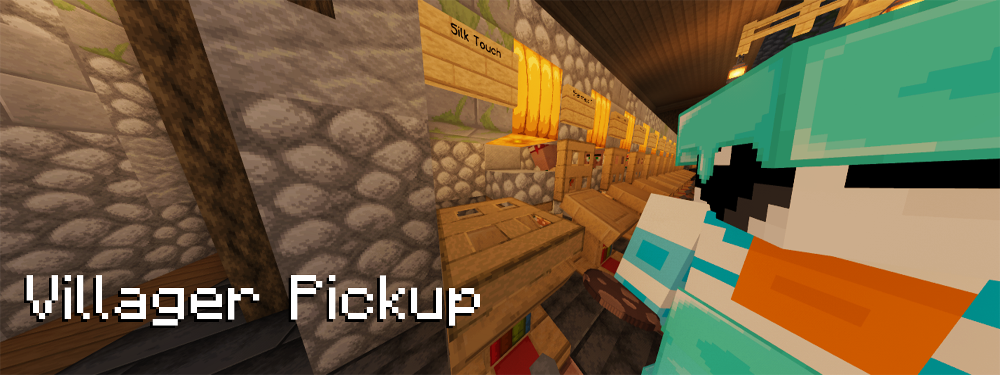

# Villager Pickup

Villager Pickup allows you to pick up villagers 
into spawn eggs by **shift right-clicking** on them. 
The villager spawn egg will retain all NBT data of the previous villager, 
meaning they stay exactly the same as before you picked them up.

## Features

- **Easy Villager Management**: Effortlessly manage your villagers by picking them up and placing them wherever you need them.
- **NBT Data Retention**: Villagers retain all their data, ensuring they remain unchanged after being picked up.
- **Fully Server-Sided**: The mod is fully server-side, and vanilla clients can use it when installed on the server.

## Compatibility

Due to the way this mod is coded, 
it works with all modded villagers by default if they are not a separate entity 
(for example, you can't pick up wandering traders).

## Installation

1. Download the mod from [Modrinth](https://modrinth.com/mod/villager-pickup) or [CurseForge](https://www.curseforge.com/minecraft/mc-mods/villagerpickup).
2. Place the downloaded mod file into the `mods` folder of your Minecraft server.
3. Restart the server to apply the changes.

## Configuration

Is there something you want to change about the mod? 
Check out the config file that is generated after the server has started.
You will find it under `config/villager-pickup.json`.

After making changes, you don't have to restart! Just use the `/villager-pickup reload` Command.

## Usage

Simply shift right-click on a Villager. The villager will be converted into a spawn egg.
You can place them down again afterward.

## Links

- [Modrinth Page](https://modrinth.com/mod/villager-pickup)
- [CurseForge Page](https://www.curseforge.com/minecraft/mc-mods/villagerpickup)

## Contributing

Contributions are welcome! Please feel free to submit a Pull Request.

## License

This project is licensed under the CC0-1.0 License. See the `LICENSE` file for details.
